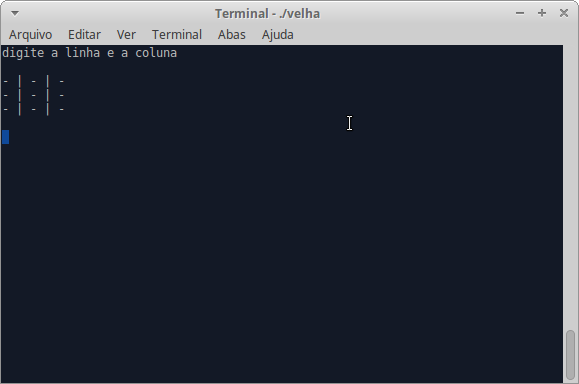

# Velha

Projeto implementado na disciplina de Fundamentos de Programação da Universidade Federal do Ceará campus Quixadá.



## Criar Executável

**Executar no terminal:** 

```terminal
gcc velha.c -o velha
```

##Iniciar Jogo

**Executar no terminal:** 

```terminal
./velha
```